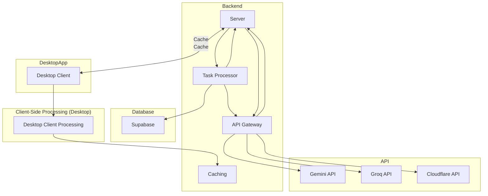

```mermaid
graph TB
    subgraph DesktopApp
        DClient[Desktop Client]
    end

    subgraph Backend
        Cache[Caching]
        Server[Server]
        TaskProc[Task Processor]
        APIGW[API Gateway]
    end

    subgraph API
        Gemini[Gemini API]
        Groq[Groq API]
        Cloudflare[Cloudflare API]
    end

    subgraph Database
        Supabase[Supabase]
    end

    subgraph ClientSide["Client-Side Processing (Desktop)"]
        DClientProc[Desktop Client Processing]
    end

    DClient --> DClientProc
    DClientProc --> Cache

    Server <-- Cache
    Cache --> DClient
    Server --> TaskProc
    TaskProc --> Supabase
    TaskProc --> APIGW
    TaskProc --> Server

    Server --> APIGW
    APIGW --> Gemini
    APIGW --> Groq
    APIGW --> Cloudflare
    APIGW --> Server

```
