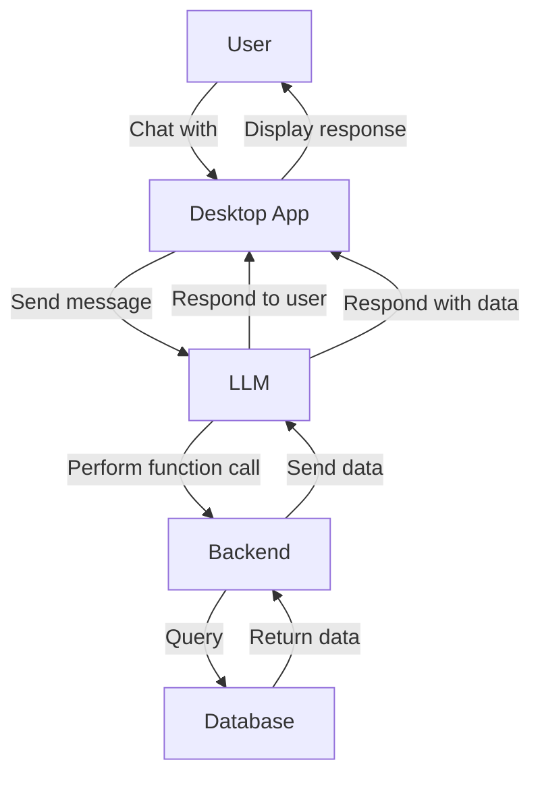

# Retrieval Augmented Generation with CTk and Groq



## Description
This project demonstrates my RAG through function calling. Though this isn't available to use right away, this repository will retrieve information based on the the two functions available, retrieve tasks or retrieve goals.

After retrieving those information you can continue discussion as normal. Additional endpoints will be added for adding tasks with association between goals and tasks are automatic through the vector embedding model from the server.

## Installation
To get started with this project, follow these steps:

```python
git clone https://github.com/pour-le-hommes/Image-connection
cd myPM
pip install -r requirements.txt
```

Lastly:
add your GROQ_API_KEY and your MY_BACKEND_WEBSITE to .env

```python
python main.py
```

## Usage
Once you have the application up and running, you can use it to integrate and manipulate videos within the GUI. This section can be expanded with more detailed usage instructions as the project evolves.

## Contributing
Contributions are welcome! If you have suggestions or improvements, please open an issue or submit a pull request.

## License
This project is licensed under the WTFPL (Do What the Fuck You Want to Public License).

## Authors
pour-le-terres (For the land)

## Acknowledgements
Special thanks to the creators of CTk and Groq for their fantastic tools that made this project possible.
